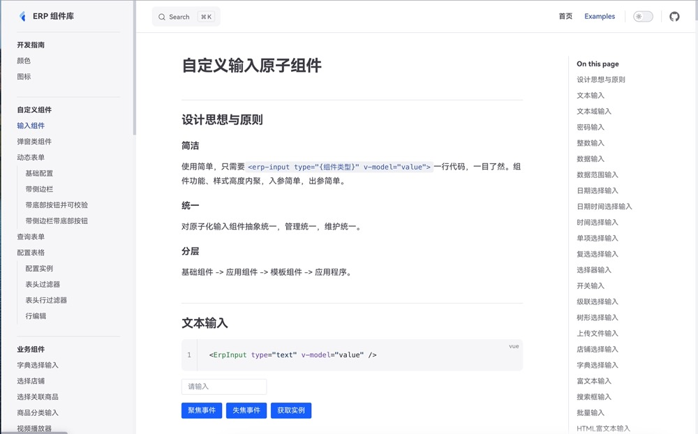
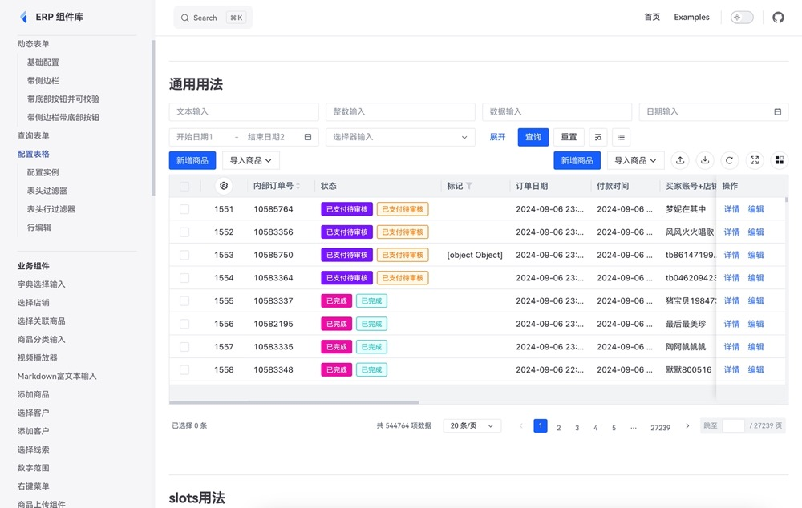

## ERP_LIB 前端基座说明
该项目是基于vue3+ts开发的极致性能的组件，通过模块化的方式组织代码，提供了丰富的基础组件和业务组件，支持依赖管理、代码提交、版本发布和文档开发等功能，适用于构建高性能的前端应用。

### 主要功能

1. **基础组件**：
- 基础组件70+
- 提供一系列基础组件，如按钮、输入框、表单等，位于 `common/components` 目录下。
- 提供工具函数和指令，位于 `common/utils` 和 `common/directives` 目录下。

2. **业务组件**：
- 业务组件30+
- 提供业务相关的组件，如客户选择弹窗、表格等，位于 `common-biz/components` 目录下。
- 提供业务相关的配置和核心功能，位于 `common-biz/config` 和 `common-biz/core` 目录下。


3. **图标组件**：
- 图标组件100+
- 提供图标相关的组件和工具，位于 `icons` 目录下。

4. **平台应用组件**：
- 提供平台应用相关的组件和功能，位于 `platform` 目录下。

基本满足平台的所有业务需求。
主要涉及技术 vue3 + ts + less + node。

## 部分效果展示

## 部分效果展示


### 依赖安装

```shell
pnpm i
```

### 代码提交

```shell
npm run cz
```

### common 版本发布

```shell
cd packages/common
npm run build
npm run pub
```

### 开发 docs

```shell
# 安装依赖
pnpm i
# 安装cli
npm run build:cli
# 安装 cli 执行
pnpm i
# 初始化components
npm run build:common
# 启动开发事例 docs
npm run dev:docs
# 暂存需要提交的代码
git add .
# 根据提示填写信息 提交代码
npm run cz
```

### 打包 docs

```shell
# 安装依赖
pnpm i
# 安装cli
npm run build:cli
# 安装 cli 执行
pnpm i
# 打包 common lib
npm run build:common
# 打包 docs
npm run build:docs
# 打包完docs生成静态文件在 docs/dist 目录下
```
