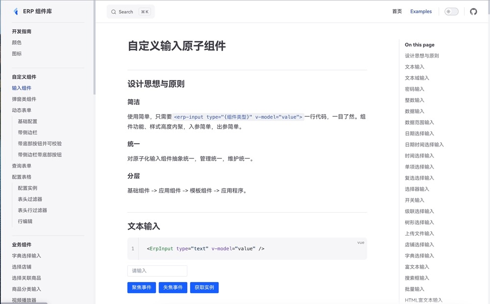
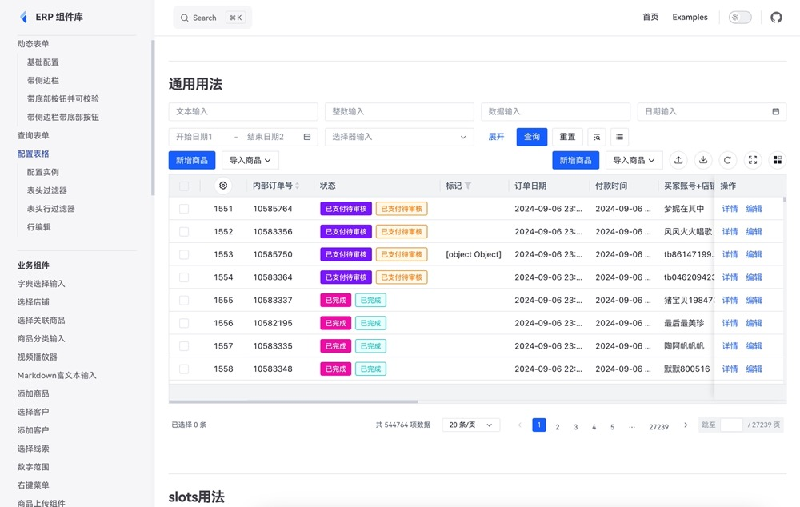

## ERP_LIB 前端基座说明
该项目是基于vue3+ts开发的极致性能的组件。

基础组件70+

图标组件100+

业务组件20+

基本满足平台的所有业务需求。

主要涉及技术 vue3 + ts + less + node。





### 依赖安装

```shell
pnpm i
```

### 代码提交

```shell
npm run cz
```

### common 版本发布

```shell
cd packages/common
npm run build
npm run pub
```

### 开发 docs

```shell
# 安装依赖
pnpm i
# 安装cli
npm run build:cli
# 安装 cli 执行
pnpm i
# 初始化components
npm run build:common
# 启动开发事例 docs
npm run dev:docs
# 暂存需要提交的代码
git add .
# 根据提示填写信息 提交代码
npm run cz
```

### 打包 docs

```shell
# 安装依赖
pnpm i
# 安装cli
npm run build:cli
# 安装 cli 执行
pnpm i
# 打包 common lib
npm run build:common
# 打包 docs
npm run build:docs
# 打包完docs生成静态文件在 docs/dist 目录下
```
